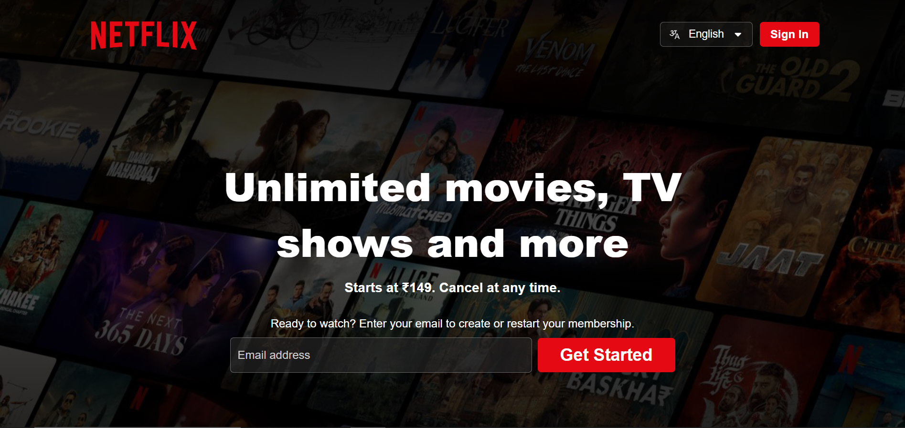

# 🎬 Netflix Clone – HTML & CSS Only

A fully responsive **Netflix landing page clone** built with **pure HTML and CSS** – no JavaScript or frameworks!  
Designed to closely replicate the official Netflix UI with clean layout, responsive behavior, and stylish dropdown animations.

---

🔗 **Live Site:** [https://wadoodshaikh.github.io/Netflix-Clone](https://wadoodshaikh.github.io/Netflix-Clone/)

---

## 📸 Preview

---

## ✨ Features

- ✅ Fully responsive layout using CSS media queries
- ✅ Hero section with email input + CTA
- ✅ Trending section with scrollable thumbnails
- ✅ Feature cards with gradient backgrounds
- ✅ FAQ section with hover-expand answers (CSS-only!)
- ✅ Styled newsletter box
- ✅ Fully built footer with columns and buttons
- 🚫 No JavaScript used at all — clean HTML and CSS

---

## 🛠️ Tech Stack

- **HTML5**
- **CSS3**
- **Responsive Design (Media Queries)**
- Fonts: *Roboto*, *Fira Sans*

---

## 📁 Folder Structure

netflix-clone/ 
├── index.html 
├── styles/ 
│   ├── style.css 
│   └── responsive-style.css 
├── images/ 
│   ├── logo.png 
│   ├── add-icon.svg 
│   ├── slide1.webp 
│   ├── slide2.webp 
│   └── ... (other images) 
├── README.md 
 
---

## 📱 Responsiveness

This site looks great on:
- 💻 Desktop
- 📱 Mobile
- 📟 Tablets

Responsive behavior handled in `responsive-style.css`.

---

## 🧠 What I Learned

- Structuring a landing page from scratch
- Using `max-height` and `overflow: hidden` for CSS-only dropdowns
- Flexbox and media queries for layout control
- Building real-world styled components (hero, cards, footer)
- Separating base and responsive styles for clean maintainability

---

## 💡 How to Use This Project

Feel free to fork or clone this project if you want to:
- Practice layout skills with HTML/CSS
- Use this design for your portfolio
- Build on top with JavaScript or React

---

## 🙌 Acknowledgements

- Inspired by the official Netflix landing page UI.
- Netflix branding & styling used here for educational and non-commercial purposes.

---

## 📮 Feedback & Contributions

If you have any suggestions or ideas to improve this clone — open an issue or pull request!  
Let’s learn and build better together 🚀

---

### 👨‍💻 Created by **Michihiro**
_“Don’t just binge-watch Netflix. Build it.”_

